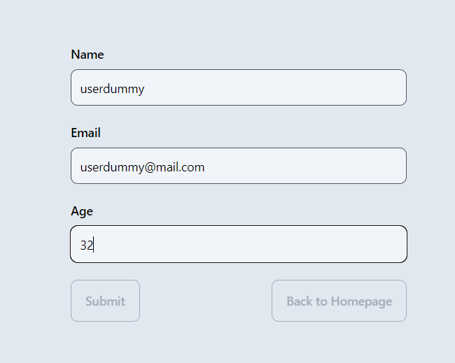

# technicalTest_RimbaAnantaVikasa

This program was created as a technical test for PT RIMBA ANANTA VIKASA, currently their isn't any deployable link and its still missing a testing with jest, But the overall code is stable could be run locally in your desired machine. this program is website that could allow the user to see, search, add, edit, and delete a user that are shown in the website.

## HOW TO INSTALL

1. git clone https://github.com/athiflanang/technicalTest_RimbaAnantaVikasa.git
2. cd to backend
   - npm i
   - update the config file with the desired database name, make it unique to prevent conflict with other database, then create database (npx sequelize-cli db:create)
   - run migration (npx sequelize-cli db:migrate)
   - seed the database (npx sequelize-cli db:seed:all)
   - cd back to main file (cd ..)
3. cd to frontend
   - npm i
   - cd back to main file (cd ..)

## HOW TO RUN

1. open 2 terminal, 1 for backend, 1 for frontend
2. run the backend first
   - node .\bin\www.js
3. run the frontend second
   - npm run dev

## HOW TO USE

### Fetch all user (GET /users)

by default, the data should be fetch starting the website

### Fetch user by id (GET /users/:id:)

1. insert the desired UUID in the search bar, then click the search button

2. the table should update based on the inputed UUI

3. to return the table to its original position, delete the UUID in the search bar then click search button again

### Add new user (POST /users:)

1. click the add user button

2. the screen will change to a form, fill in the form, than later click submit, if you want to return to the homepage, click the back to homepage button

3. after clicking the submit button, you will be navigate to main homepage with the new user

### Update user by id (PUT /users/:id:)

1. click the edit button in the action column

2. you will then be navigate to the edit form, update the current user data as required, after you finished, click the submit button, if you want to return to the homepage, click the back to homepage button

3. after clicking the submit button, you will then be navigate to the main homepage with the updated user data

### Delete user (DELETE /users/:id:)

1. to delete a user, simply click the delete button in the action column

2. the table will then refresh with the updated table
